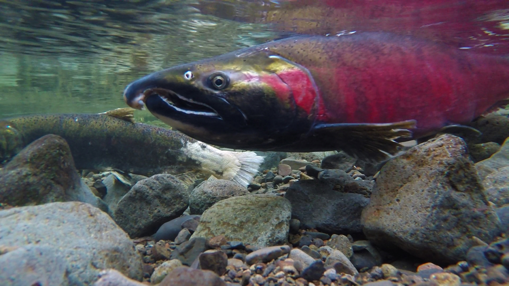
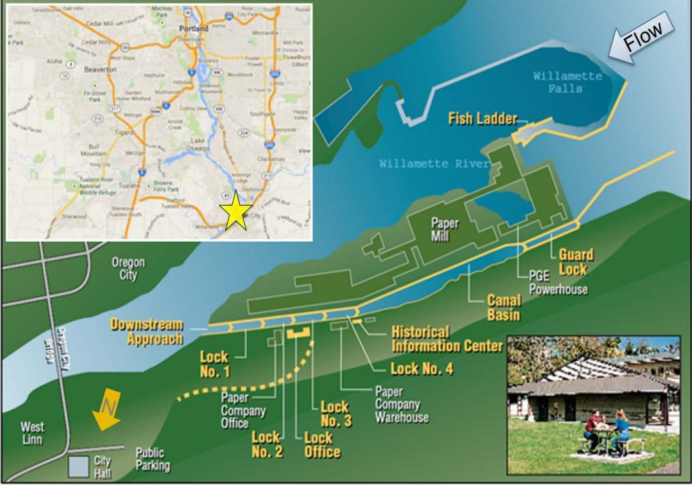

```{r setup, include=TRUE, echo = TRUE, message = FALSE, warning = FALSE}
knitr::opts_chunk$set(echo = TRUE, message = FALSE, warning = FALSE)

library(tidyverse)
library(here)
library(janitor)
library(lubridate)
library(tsibble)
library(feasts)
library(fable)
library(cowplot)
```


# Overview {.tabset}

This analysis explores fish passage data from 2001 to 2010 at the Willamette Falls fish ladder in Oregon. Data were shared and accessed from Columbia River Data Access in Real Time (DART), courtesy of the Oregon Department of Fish and Wildlife (ODFW). This analysis examines steelhead, coho, and coho jack salmon through time series, seasonal plots, and total counts.

**Data Citation:** Columbia Basin Research, University of Washington. 2023. DART Adult Passage Graphics & Text. [http://www.cbr.washington.edu/dart/query/adult_graph_text.](http://www.cbr.washington.edu/dart/query/adult_graph_text.)





```{r}
### Read in the data

will_fish <- read_csv(here("data", "willamette_fish_passage.csv")) %>%replace(is.na(.), 0) %>%
  clean_names() %>% 
  select("date", "coho", "jack_coho", "steelhead") 

### Read date and make tibble

fish_ts <- will_fish %>% 
  mutate(date = mdy(date)) %>% 
  as_tsibble(key = NULL, index = date)
```


## Original Time Series

```{r}
### Make date on x-axis and fish count on y-axis

fish_long <- fish_ts %>%
  pivot_longer(cols = 2:4, names_to = "species", values_to = "count") %>% 
    mutate(species = case_when(
    species == "coho" ~ "Coho",
    species == "jack_coho" ~ "Jack Coho", 
    species == "steelhead" ~ "Steelhead"))
```

```{r figure 1, fig.align='center', fig.cap="Figure 1: Time series plot of total fish counts by date and species from January 1, 2001 to December 31, 2010."}

### Make plot

ggplot(data = fish_long, aes(x = date, y = count, color = species))+
  geom_line(size = 0.5, alpha = 0.9)+
  theme_minimal()+
  labs(x = "Date",
       y = "Fish Count",
       title = "Salmon Count at Willemette Falls Fish Passage",
       subtitle = "2001-01-01 to 2010-12-31")+
  scale_color_manual(values = c("salmon", "green4", "skyblue")) 
```


Based on this plot:

-  Coho salmon counts appear to have noticeably increased starting in 2009.
- At a glance, steelhead salmon populations have not changed much over time, with relatively consistent seasonal trends.
- Coho and jack coho salmon have overlapping seasonal trends; steelhead salmon mostly pass through Willamette Falls at a different time of year.


## Seasonplots

```{r figure 2, fig.align='center', fig.cap="Figure 2: Seasonplot of daily counts for coho, jack coho, and steelhead salmon from January 1, 2001 to December 31, 2010."}

fish_long %>% 
  gg_season(y = count) + 
  theme_minimal() +
  labs(x = element_blank(), y = "Daily Fish Count",
       title = "Daily Salmon Count at Willemette Falls Fish Passage",
       subtitle = "2001-01-01 to 2010-12-31") +
  scale_color_viridis_c(breaks = seq(1, 10, 3), labels = seq(2001, 2010, 3))
```


Based on this plot:

- Coho and jack coho salmon pass through the falls around October. 
- Steelhead salmon pass through the falls year round but are most present in spring and summer.


## Annual Counts by Species

```{r}
### Get counts by year and species

fish_annual <- fish_long %>% 
   index_by(year = ~year(.)) %>% 
  group_by(year, species) %>% 
  summarize(annual_count = sum(count))
```

```{r figure 3, fig.align='center', fig.cap="Figure 3: Annual counts of coho, jack coho, and steelhead salmon from 2001-2010."}

### Make plot

ggplot(data = fish_annual, aes(x = year, y = annual_count, color = species)) +
  geom_line(size = 0.75) +
  theme_minimal() +
  scale_x_continuous(n.breaks = 10)+
  labs(x = "Year", y = "Annual Count", 
       title = "Annual Salmon Count at Willemette Falls Fish Passage",
       subtitle = "2001-01-01 to 2010-12-31") +
  scale_color_manual(values = c("salmon", "green4", "skyblue")) 
```


Based on this plot:

- The annual count of steelhead salmon is greater than coho and jack coho, with the exception of around 2008 to 2009. Steelhead numbers plateau a bit around 2007, but increase again around 2009. 
- Coho salmon increase in 2008, temporarily surpassing steelhead until after 2009, when coho numbers begin to decline again. 
- Jack coho salmon have the lowest and most consistent count. 


