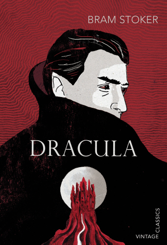

```{r setup, include=TRUE, echo = TRUE, message = FALSE, warning = FALSE}
knitr::opts_chunk$set(echo = TRUE, message = FALSE, warning = FALSE)

library(tidyverse)
library(here)
library(tidytext)
library(textdata)
library(pdftools)
library(ggwordcloud)
```


## Overview

This analysis examines the word count and connotations of Bram Stoker's well-known 1897 novel *Dracula*. I analyzed the most frequently used words throughout first and last chapters of the book, in addition to the book in its entirety. I then performed a sentiment analysis using the NRC lexicon (Mohammed & Turney, 2013).

]


```{r}
### Read in pdf

dracula <- pdf_text(here("data", "dracula.pdf"))

### Checking text 

# drac_p100 <- dracula[100]
# drac_p100
```

```{r}
### Make a df

drac_lines <- data.frame(dracula) %>% 
  mutate(page = 1:n()) %>%
  mutate(text_full = str_split(dracula, pattern = '\\n')) %>% 
  unnest(text_full) %>% 
  mutate(text_full = str_squish(text_full))
```

```{r}
### Tidy by chapter

drac_chapts <- drac_lines %>% 
  slice(-(1:12)) %>% 
  mutate(chapter = ifelse(str_detect(text_full, "CHAPTER"), text_full, NA)) %>% 
  fill(chapter, .direction = 'down') %>% 
  separate(col = chapter, into = c("ch", "num"), sep = " ") 
  # mutate(chapter = as.numeric(as.roman(num)))
```

```{r}
### Get word counts by chapter

drac_words <- drac_chapts %>% 
  unnest_tokens(word, text_full) %>% 
  select(-dracula)

drac_wordcount <- drac_words %>% 
  count(num, word)
```

```{r}
### Remove stop words

drac_words_clean <- drac_words %>% 
  anti_join(stop_words, by = 'word')

nonstop_counts <- drac_words_clean %>% 
  count(num, word)
```


## Top 10 Words

```{r figure 1, fig.align='center', fig.cap="Figure 1: Top 10 words in the first chapter, with stop words removed."}
### top 10 words chapter 1

top_10_words_ch1 <- nonstop_counts %>%
  filter(num == 1) %>% 
  arrange(-n) %>%
  slice(1:10)


ggplot(data = top_10_words_ch1, aes(x = n, y = reorder(word, -n))) +
  geom_col(fill = "red4") +
  labs(x = "Count", y = "Word", title = "Top 10 Most Frequently Used Words in Chapter 1")
```

```{r figure 2, fig.align='center', fig.cap="Figure 2: Top 10 words in the final chapter, with stop words removed."}
### top 10 words chapter 27

top_10_words_ch27 <- nonstop_counts %>%
  filter(num == 27) %>% 
  arrange(-n) %>%
  slice(1:10)


ggplot(data = top_10_words_ch27, aes(x = n, y = reorder(word, -n))) +
  geom_col(fill = "red4") +
  labs(x = "Count", y = "Word", title = "Top 10 Most Frequently Used Words in Chapter 27")
```


```{r figure 3, fig.align='center', fig.cap="Figure 3: Top 10 words in the whole book, with stop words removed."}
### top 10 words in whole book

top_10_words_b <- nonstop_counts %>% 
  arrange(-n) %>% 
  slice(1:10)

ggplot(data = top_10_words_b, aes(x = n, y = reorder(word, -n))) +
  geom_col(fill = "darkslategray")+
  labs(x = "Count", y = "Word", title = "Top 10 Most Frequently Used Words in" ~italic("Dracula"))
```


## Top 100 Words

```{r figure 4, fig.align='center', fig.cap="Figure 4: Word cloud of top 100 words in the whole book."}
### word count for top 100 words in whole book

drac_top100 <- nonstop_counts %>% 
  arrange(-n) %>% 
  slice(1:100)
drac_cloud <- ggplot(data = drac_top100, aes(label = word)) +
  geom_text_wordcloud(aes(color = n, size = n), shape = "diamond") +
  scale_size_area(max_size = 6) +
  scale_color_gradientn(colors = c("darkslategray","red4","red2")) +
  theme_minimal()

drac_cloud
```


## Sentiment Analysis

```{r figure 5, fig.align='center', fig.cap="Figure 5: Sentiment analysis using NRC lexicon. Red bars indicate more positive emotions and the dark gray indicate negative emotions."}
### sentiment analysis using nrc lexicon

nrc_lex <- get_sentiments(lexicon = "nrc")

### bind got data to nrc

drac_nrc <- drac_words_clean %>% 
  inner_join(get_sentiments("nrc"))

### get count by sentiment bin

drac_nrc_counts <- drac_nrc %>% 
  count(sentiment)

ggplot(data = drac_nrc_counts, aes(x = n, y = reorder(sentiment, -n), fill = sentiment))+
  scale_fill_manual(values=c("anticipation" = "red3",
                             "joy" = "red3",
                             "positive" = "red3",
                             "trust" = "red3",
                             "surprise" = "red3",
                             "sadness" = "darkslategray",
                             "disgust" = "darkslategray",
                             "anger" = "darkslategray",
                             "negative" = "darkslategray",
                             "fear" = "darkslategray"))+
  geom_col()+
  labs(x = "Count", y = "Sentiment", title = "Sentiment Analysis of" ~italic("Dracula"))+
  theme_minimal()+
  theme(legend.position = "none")
```


## Citations

Stoker, B. (1920) Dracula . Garden City, N.Y. Doubleday, Page & Co. 

Crowdsourcing a Word-Emotion Association Lexicon, Saif Mohammad and Peter Turney, Computational Intelligence, 29 (3), 436-465, 2013.


